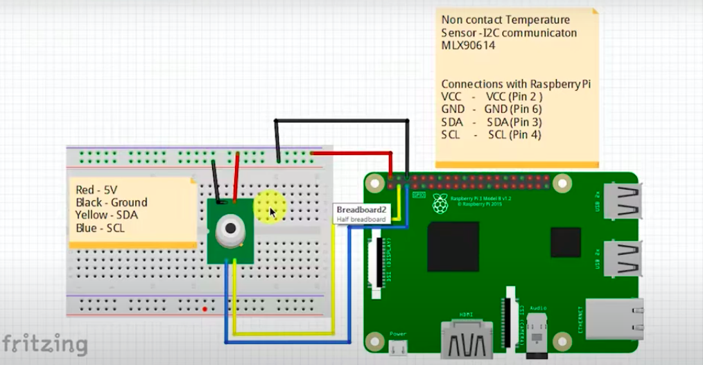
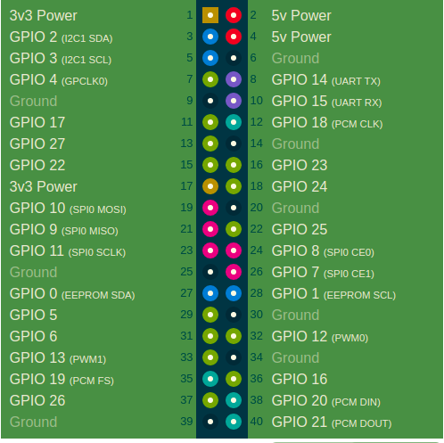
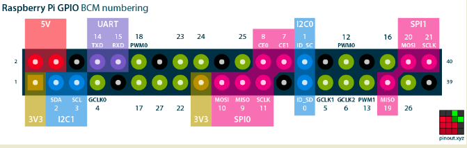
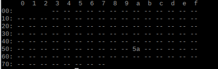

# Raspberry-Pi-Device

# Description
This project uses *Tensorflow* and *openCV* with *python* and [PHP](https://github.com/CovMan-Knust-final-year-project/Admin/tree/main/Iot) for the apis.
The raspberry pi 3B was used for the project. It turns out that Tensorflow runs extremely slow on this particular version of raspberry pi
especially for the facial recognition and nose mask aspect.

So the [facial_section] is run on the host machine. And a server listens for data from the host machine to start working the PI processes.
Processes include
- [Run code to recognize faces on host machine](https://github.com/CovMan-Knust-final-year-project/Raspberry-Pi-Device/blob/main/facial_section/facial_req.py)
- [Start server on PI for recieving name of person from host machine](https://github.com/CovMan-Knust-final-year-project/Raspberry-Pi-Device/blob/main/main.py)
- [Use name to find id of person]
- [Use id to mark attendance]
- [Scan and save temperature using id of person]
- [Dispense sanitizer]
- [Send Sms to person]

### Components
- Raspberry Pi 3B
- Raspberry Pi camera
- GY-906 mlx90614esf Non-contact infrared temperature sensor
- Jumper Wires
- Bread board


## installation
I. (optional) Install Anaconda

II. (optional)
Activate conda virtual env
```
conda activate
```

1. install Tensorflow
```
pip3 install tensorflow --user
```
 
2. install OpenCV
```
pip3 install opencv-python
```

3. check tensorflow, and display tensorflow version
```
import tensorflow as tf
tf.__version__

check OpenCV, and display OpenCV version
import cv2
cv2.__version__
```

4. install face-recognition
```
pip3 install face-recognition
```

5. install imutils
```
pip3 install imutils
```

6. follow instructions in `/facial_section/README.md` to set up the facial recognition
- add images to dataset folder if you need to identify more persons (you can use [headshots.py](https://github.com/CovMan-Knust-final-year-project/Raspberry-Pi-Device/blob/main/facial_section/headshots.py]) to take multiple pictures
- train dataset using [train_model.py](https://github.com/CovMan-Knust-final-year-project/Raspberry-Pi-Device/blob/main/facial_section/train_model.py) after adding the images


## set up the GY-906 mlx90614esf Non-contact infrared temperature sensor

1. Turn i2c interfacing ON in Raspberry pi configurations

2. [PyMLX90614 python installation files]("https://pypi.org/project/PyMLX90614")

3. install the packages using pip3
```
pip3 install PyMLX90614
```

4. assemble the temperature components onto the PI. Setup the sensor on the PI.
- https://www.youtube.com/watch?v=4V0_PBwg4c0
- Circuit setup
    a. Circuit design
        

    b. [Circuit pins](https://pinout.xyz/)
        
        

5. Enter this in terminal
```
ls /dev/*i2c*
```

6.ensure the device is available on the i2c bus. Type
```
i2cdetect -y 1
```

- output should look like this showing that sensor is functional
    


7. Make new file and copy and paste code to record the temperature
```
from smbus2 import SMBus
from mlx90614 import MLX90614

bus = SMBus(1)
sensor = MLX90614(bus, address=0x5A)
print(sensor.get_ambient())
print(sensor.get_object_1())
bus.close()
```

## running

run ```/facial_section/facial_req.py``` on host machine

run ```main.py``` in Pi device


